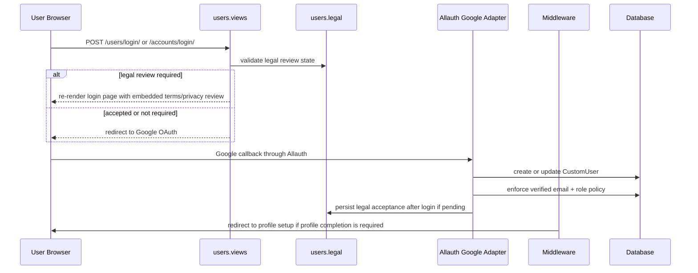
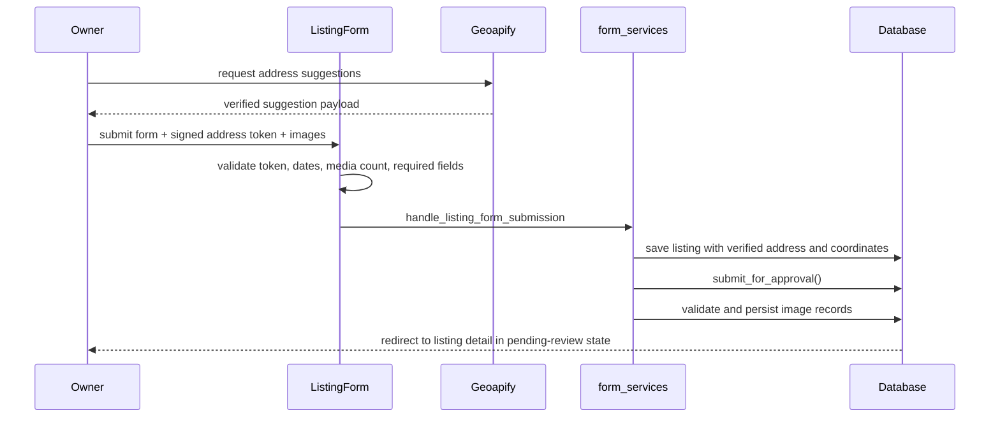

# Request Lifecycle

This document explains the main end-to-end flows through Padly and where each responsibility lives.

## 1. Google Login, Legal Acceptance, and Profile Completion

### Components involved

- `users/views.py`
- `users/adapters.py`
- `users/legal.py`
- `users/middleware.py`
- `users/signals.py`
- `users/session_security.py`

### Important behaviors

- Login initiation is rate limited.
- Google login is the only supported auth path.
- Existing users with current legal acceptance do not need to reaccept.
- Stale legal acceptance causes logout and re-entry through the review flow.
- Profile completion can gate the rest of the app until `profile_completed_at` is set.

## 2. Listing Create/Edit and Moderation Submission

### Components involved

- `listings/forms.py`
- `listings/address_provider.py`
- `listings/address_signing.py`
- `listings/form_services.py`
- `listings/views.py`

### Important behaviors

- Geoapify configuration controls whether verified address authoring is available.
- Freeform address entry is not accepted as a fallback when verification is required.
- Edit flows preserve the saved verified address if the address remains unchanged.
- Every create or edit resubmits the listing to the review queue.
- Listings require at least one photo after add/remove operations are applied.

## 3. Marketplace Browse, Filters, and Map Search

### First page render

1. `listings.views.listing_list` resolves the base marketplace queryset from `marketplace_listings_for_user()`.
2. Standard filters from `apply_listing_filters()` are applied.
3. The page is rendered with:
   - server-side cards
   - initial JSON payload for markers and card data
   - map style and satellite style configuration
4. The frontend boots MapLibre and the live search controller.

### Live search

1. The browser updates map bounds or filters.
2. `static/js/listings-page.js` builds query params from form state and viewport bounds.
3. `/listings/search/` returns a JSON payload of cards and markers.
4. `static/js/listings-results.js` and `static/js/listings-map-view.js` update the UI in place.

### Important behaviors

- The map payload is always filtered by current viewport bounds.
- `/listings/`, `/listings/search/`, and normal listing detail are login-gated; the landing page is the only anonymous listing teaser surface.
- Marketplace surfaces show only listings that satisfy the public visibility rule, including active ownership, even for admins.
- Listing-only users see their own inventory rather than the marketplace.
- Favorite state is annotated server-side and reflected in live-search card payloads.

## 4. Listing Detail, Messaging, Reviews, and Reports

### Detail page load

- `accessible_listing_detail_queryset()` determines which listing records are visible to the current user.
- Detail context includes:
  - favorite eligibility
  - existing conversation state
  - review/report eligibility
  - listing media and structured amenity lists

### Contact flow

1. A student or admin submits a message from listing detail.
2. `communications.services.start_listing_conversation()` validates access and listing visibility.
3. The conversation is created or reused.
4. A first message is written inside a transaction.
5. A websocket event is published on commit.

### Feedback flow

- Reviews require:
  - student role
  - approved listing
  - not the owner
  - prior conversation with the lister
- Reports require:
  - student role
  - approved listing
  - not the owner
  - no already-open active report by that reporter for the same listing

## 5. Inbox and Websocket Lifecycle

### HTTP inbox flow

1. `communications.views.messages_inbox` loads visible conversations.
2. Selecting a conversation marks it read.
3. Replies go through `send_listing_message()`.
4. Delete actions soft-delete the conversation for the current viewer.

### Websocket flow

1. Browser connects to `/ws/messages/`.
2. `MessagesConsumer` authenticates the socket via the session-backed auth stack.
3. The consumer subscribes the user to `messages-user-<id>`.
4. Events published by `communications.services` are pushed into that per-user group.

### Important behaviors

- Only authenticated active users can connect.
- Only conversation participants can send messages.
- Unsupported websocket actions return a structured error payload.
- Read-state and new-message events include summary deltas for unread counters.

## 6. Admin Moderation Flow

### Listing review

1. Admin opens `/users/admin-listings/` or a listing detail page in the custom admin workspace.
2. `admin_listings_queryset()` orders pending review items first.
3. Approve or reject actions post to `admin_review_listing`.
4. Rejections require review notes.

### Report resolution

1. Admin opens `/users/admin-reports/`.
2. Open reports are prioritized first and each queue card includes reporter, owner, and moderation context.
3. Closing a report requires resolution notes.
4. Reopening a report clears resolution metadata.

### User operations

- Admins can review users, activity previews, and listing/file/message counts.
- Admins can grant or restore admin access for other users.
- Admins cannot change their own role or deactivate themselves through the admin workspace.
