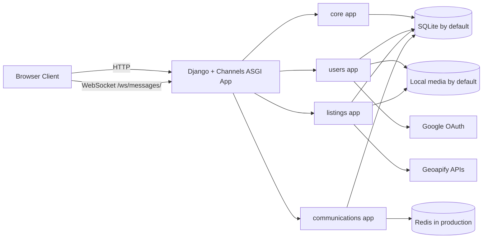

# System Overview

## Purpose

Padly is a housing marketplace tailored to the Boston College community. It combines:

- Google-authenticated user accounts
- Role-aware access control
- Listing authoring with verified addresses and media uploads
- A public marketplace with list and map browsing
- Private document storage for users
- A custom moderation workspace for admins
- Realtime listing conversations over websockets

## Runtime Topology

## Entrypoints

| Layer | Location | Notes |
| --- | --- | --- |
| HTTP URL root | `vibecoders/urls.py` | Mounts `core`, `users`, `listings`, `communications`, and Allauth routes |
| ASGI entrypoint | `vibecoders/asgi.py` | Required for production messaging because websockets are part of the live app |
| Websocket routing | `vibecoders/routing.py` | Currently exposes `/ws/messages/` only |
| Settings | `vibecoders/settings.py` | Environment-driven runtime, security, auth, maps, rate limits, channels, logging |

## Application Boundaries

| App | Responsibilities | Notable Boundaries |
| --- | --- | --- |
| `core` | Landing page, legal pages, shared utilities, branding context, cache-backed rate limits | Does not own domain data beyond shared helpers |
| `users` | Custom user model, profile flows, dashboard, document library, legal acceptance, admin workspace | Owns auth policy and private user file handling |
| `listings` | Listings, images, filters, favorites, reviews, reports, moderation state, address verification, roommate posts | Owns marketplace rules, moderation transitions, and listing lifecycle |
| `communications` | Listing conversations, messages, inbox selectors, realtime publishing, websocket consumer | Owns conversation state and websocket event flow |

## External Integrations

| Integration | Purpose | Critical Notes |
| --- | --- | --- |
| Google OAuth via Allauth | Login and verified email identity | Email/password signup is intentionally disabled |
| Geoapify autocomplete | Verified address selection during listing authoring | Authoring fails closed if lookup is not configured |
| Geoapify or configured MapLibre style | Base map styling | Marketplace map falls back to list-only mode if the base style is unavailable |
| Satellite map style | Optional alternate map view | Defaults to `builtin://satellite`; can be overridden by env |
| Redis | Production channel layer | Required when `DJANGO_DEBUG=false` |

## High-Level Feature Surfaces

| Surface | Primary Routes | Backing App |
| --- | --- | --- |
| Landing and legal pages | `/`, `/terms/`, `/privacy/` | `core` |
| Login and account workspace | `/users/login/`, `/users/dashboard/`, `/users/profile/setup/` | `users` |
| Marketplace and listing authoring | `/listings/`, `/listings/create/`, `/listings/<id>/` | `listings` |
| Roommate posts and group discovery | `/listings/group-match/` | `listings` |
| Inbox and threads | `/users/messages/` and `/ws/messages/` | `communications` |
| Admin workspace | `/users/admin-*` | `users` + `listings` |

## Primary System Guarantees

- Authentication is Google-only and requires a verified provider email.
- Legal acceptance is versioned and enforced before login can complete.
- Profile completion can be enforced before normal app use.
- Public listings are approved-only, available-only, not hidden, and not expired.
- Resolving a legitimate listing report removes that listing from the public marketplace until it is corrected and reapproved.
- Listing authoring requires a provider-verified address selection when Geoapify is configured.
- Private user uploads are never served from raw `/media/` routes.
- Conversations are unique per `(listing, participant)` and only participants can send messages.
- Realtime events are published after database success using `transaction.on_commit()`.

## Known Operational Constraints

- Development defaults use SQLite, local media, and an in-memory channel layer.
- Production requires explicit `DJANGO_SECRET_KEY`, `DJANGO_ALLOWED_HOSTS`, and `CHANNEL_REDIS_URL`.
- Listing photos are served from a development-only media route; private user files always go through authenticated views.
- File/image blobs are deleted after commit, but storage-level orphan cleanup is still an operational concern if an outer transaction fails after a blob write.
